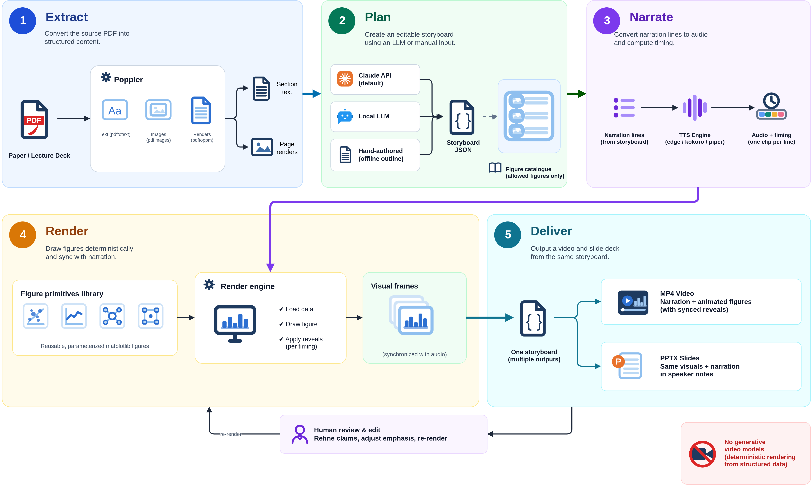

# Paper2Video

**Papers you can watch!**

Paper2Video reads a machine-learning paper or a lecture deck and produces a narrated
explainer video in which animated technical figures are drawn in step with the sentence
being spoken. The same storyboard file also renders as a PowerPoint deck with the
narration in the speaker notes.

Everything visual is computed and deterministic. The figures are matplotlib drawings
whose numbers can be checked against the paper; no generative video model is involved.

Site: https://alinadevkota.github.io/Paper2Video/

## How it works?

1. **Extract.** Poppler pulls section text, page renders and embedded figures from the PDF.
2. **Plan.** Claude drafts a storyboard JSON against a fixed schema. The prompt carries the
   live figure catalogue, so the model can only name figures that exist; anything the
   validator rejects is sent back for repair. The storyboard is a file you edit.
3. **Narrate.** Each narration line becomes one cached audio clip. Scene length is measured
   from the audio, so reveals land on the sentence that explains them.
4. **Render.** Every frame is drawn from scratch in matplotlib by a library of reusable
   figure primitives and piped to ffmpeg, with subtitles.
5. **Deliver.** One storyboard yields an MP4 and a PPTX.

The figure library has 100 primitives (generic shapes such as `pipeline`, `curve_family`,
`vector_decompose`) and 181 presets (a primitive plus options, pure data). A new paper
normally contributes presets only. The library is still young, though: most papers call
for shapes it does not have yet, and growing it substantially is the main work ahead. A regression harness renders every primitive with
empty options, every preset and every scene of every storyboard: 281/281 figures and
231/231 scenes across 13 storyboards.

## Repository layout

    src/              the tool: renderer, figure library, storyboard planner, PPTX export
    storyboards/      one storyboard JSON per paper or lecture
    docs/             the pipeline diagram and design notes
    videos/           rendered videos of papers and lectures by others (mp4, 1080p, subtitle track)
    videos/mine/      videos of my own first- and second-author papers
                      (their posters and captions go to posters/mine/ and captions/mine/)
    index.html        the project site, served by GitHub Pages from the repo root
    posters/          one frame per video, shown before it plays
    figures/          frames cropped to the drawing, for the site's figure wall
    captions/         each video's subtitle track as WebVTT, for the site's players
    make_assets.py    rebuilds posters/, figures/ and captions/ from videos/
    assets.json       what make_assets.py last produced

See [src/README.md](src/README.md) for setup and commands, [storyboards/README.md](storyboards/README.md)
for naming, and [docs/README.md](docs/README.md) for the diagram.

## Quick start

    pip install -r src/requirements.txt
    sudo apt install ffmpeg poppler-utils espeak-ng          # or brew install ...

    python src/paper2video.py --figures                                   # the figure catalogue
    python src/make_storyboard.py paper.pdf -o storyboards/name.json      # draft a storyboard with Claude
    python src/paper2video.py storyboards/name.json -o videos/name.mp4    # render the video
    python src/storyboard2pptx.py storyboards/name.json --per-beat        # and the deck

Planning needs `ANTHROPIC_API_KEY` in the environment (or `--planner local` for an
OpenAI-compatible endpoint, or `--planner outline` for no model at all). Rendering needs
only a text-to-speech engine, ffmpeg and poppler.

## The site

`index.html` is a single static page with no build step and no external requests. It
follows the theme of [alinadevkota.github.io](https://alinadevkota.github.io/) and shares
its light/dark setting.

Preview locally:

    python serve.py                   # then open http://localhost:8000

`serve.py` is a few lines over Python's built-in server that add HTTP range support, so
video seeking and the click-to-jump links behave as they do on GitHub Pages. Plain
`python -m http.server` also works but cannot seek inside videos.

### Adding a video

1. Render it to `videos/name.mp4`, or `videos/mine/name.mp4` for one of my own papers, and put
   its storyboard at `storyboards/name.json`.
2. Add `name` to `POSTER` and `WALL` in `make_assets.py`, then run it. It needs only
   OpenCV and NumPy and writes the poster, wall tiles and WebVTT captions.
3. Add an entry at the bottom of `index.html`: to the `VIDEOS` array for papers and
   lectures by others, or to the `MINE` array for my own first- and second-author papers
   (same fields, plus `mine: true` and `role: "First author"` or `"Second author"`, shown
   as a badge).
   Paste any new tiles into the `WALL` array beside them.

## Publishing

Push to GitHub, then in the repository settings enable Pages from the `main` branch,
root folder. `.nojekyll` makes Pages serve the files as they are. `robots.txt` and
`sitemap.xml` are for search engines; the page also carries JSON-LD structured data for the
site, the FAQ and every video, generated from the same arrays that build the cards.

The videos total about 300 MB. Every file is under GitHub's 100 MB per-file limit, so they
are committed directly. Do not put them in Git LFS: GitHub Pages does not serve LFS objects.

## License

CC0 1.0. Lecture figures are cropped from course slides and credited on the frame; paper
figures are used for commentary and attributed to their authors.
